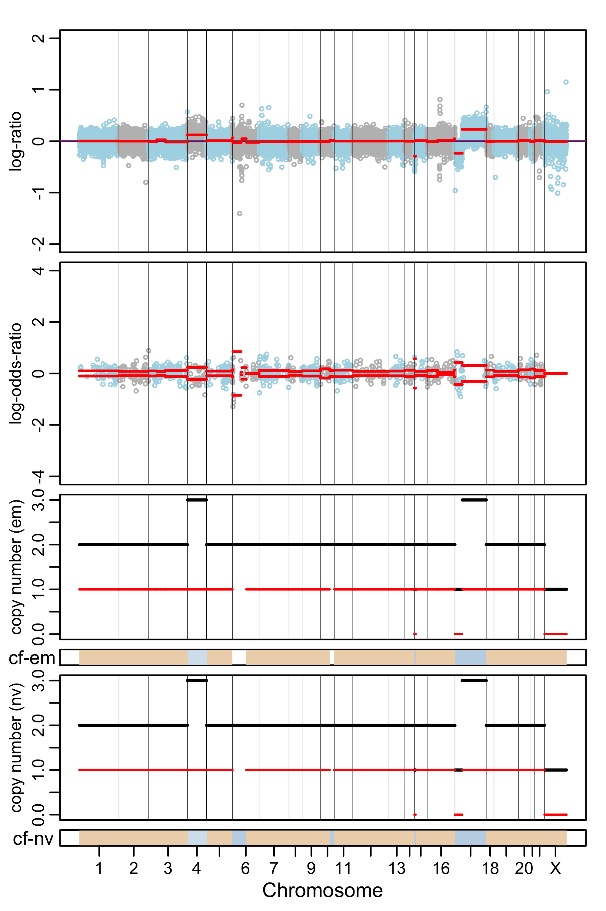

# facets2n
<!-- badges: start -->
[](https://github.com/rptashkin/facets2n/actions)
[](https://app.codecov.io/gh/rptashkin/facets2n?branch=master)
[](https://lifecycle.r-lib.org/articles/stages.html#experimental)
<!-- badges: end -->

Algorithm to implement Fraction and Allelic Copy Number Estimates from Tumor:normal Sequencing using unmatched normal sample(s) for log ratio calculations.

## Table of Contents 
   * [Aims](#key-aims)
   * [Implementation](#sparkles-implementation-sparkles)
   * [Requirements](#requirements)
   * [Installation](#installation)
   
   Vignettes
   
   * [Analysis of T/N pair using set of reference normals &amp; sequencing batch control (PoolNormal)](#analysis-of-tn-pair-using-set-of-reference-normals--sequencing-batch-control-poolnormal)
     * [(1) Generate Reference Files](#1-generate-reference-files)
     * [(2) snp-pileup command to generate a counts file for input data](#2-snp-pileup-command-to-generate-a-counts-file-for-input-data)
     * [(3) Analysis](#3-analysis)
     * [(3) Plot](#3-plot)
     * [(4) QC fit](#4-qc-fit)
     
   * [Analysis of post transplant tumor samples with donor data](#analysis-of-post-transplant-tumor-samples-with-donor-data)
     * [(1) Generate counts file for donor sample(s)](#1-generate-counts-file-for-donor-samples)
     * [(2) Analyze and plot](#2-analyze-and-plot)
   
   * [Inaccurate results without baseline donor sample](#inaccurate-results-without-baseline-donor-sample)
 
## :key: Aims 

1. Increase sensitivity of the original FACETS algorithm by [Shen R, & Sheshan V.E. (2016) *Nucleic Acids Res.*](https://pubmed.ncbi.nlm.nih.gov/27270079/) 
     - *Problem addressed*:
          - FFPE tumor and matched normal tissues (e.g. blood) may result in noisy log ratio calculations due to sample specific biases, namely GC and insert size distibutions, in addition to batch effects, therefore decreasing the sensitivty of joint segmentation.

2. Enable allele-specific copy number analysis for tumor samples from patients following hematopoietic stem cell transplantation (HSCT)  
     - *Problem addressed*: 
          - Current methods are not able calculate genome-wide allele specific copy number from post tranplant (non-autogolous) samples that are chimeric for host and donor derived DNA
<br/><br/>

## :sparkles: Implementation :sparkles: 

The normal sample with computed minimal noise, realtive to tumor, is selected for copy number log2 ratio calculations (logR), while the matched normal is always selected for variant allele log odds ratio (logOR) calculation. 

:construction: (beta) infer sex from matched normal sample, and select an unmatched normal with same sex for chrX normalization.

---
## Requirements
-  R (>= 3.4.0), pctGCdata (>= 0.3.0)
- snp-pileup and HTSlib: see [Installation and usage](https://github.com/rptashkin/facets2n/blob/master/inst/extcode/README.txt)
- BAM file from tumor sample
- BAM from patient matched normal sample
- BAM(s) from unmatched normal sample(s) *(optional)*
<br/><br/>
---

## Installation

```
devtools::install_github("rptashkin/facets2n")
```

---

## Analysis of T/N pair using set of reference normals & sequencing batch control (PoolNormal)

#### (1) Generate Reference Files

Reference files only need to be generated once for a given sequencing assay and conditions. 

*We suggest at least 5 male and 5 female reference normal BAMs, that were processed in the laboratory and with an analysis pipeline using the same parameters of the tumor sample you are analyzing. For hybridization capture sequencing, we have found that a pooled sample of non-neoplastic tissue (e.g. blood from healthy donors) from 10 individuals captured and sequenced together with the data being analyzed often outperforms the matched normal and individual reference normals for minimizing noise in log ratio plots.*
<br/><br/>
##### (1a) Reference snp-pileup

```
inst/extcode/snp-pileup-wrapper.R --output-prefix reference_normals  \
  --vcf-file dbsnp_137.hg19__RmDupsClean__plusPseudo50__DROP_SORT_NOCHR.vcf \
  --unmatched-normal-BAMS "<some/path_to_bam_directory>/*-N*.bam"
```

##### (1b) Reference loess normalization

```
library(facets2n)
MakeLoessObject(pileup = PreProcSnpPileup(filename = "inst/extdata/reference_normals.snp_pileup.gz", is.Reference = TRUE), write.loess = TRUE, outfilepath = "inst/extdata/reference_normals.loess.txt", is.Reference = TRUE)
```


#### (2) snp-pileup command to generate a counts file for input data
*Note: Multiple BAM files can also be suppplied as a quoted, space seperated, string to --unmatched-normal-BAMS, as an alternative to providing reference normal files, with increased run time*

```
inst/extcode/snp-pileup-wrapper.R \
  --snp-pileup-path <optional, path to snp-pileup executable, defaults to snp-pileup in your PATH> \
  --vcf-file <path to SNP VCF, e.g. dbSNP> \
  --normal-bam Normal.bam \
  --tumor-bam Tumor.bam \
  --unmatched-normal-BAMS <"<some/path/PoolNormal.bam">
  --output-prefix <prefix for output file, e.g. Normal_Tumor_PoolNormal>
```

The above command was used to generate the following counts file for testing purposes:

```
inst/extdata/Normal_Tumor_PoolNormal.snp_pileup.gz
```


#### (3) Analysis 

parse and pre-process the input counts data (~5min): 
*including the argument refX=TRUE in call to readSnpMatrix() will force selection of a individual reference sample from chrX normalization (preffered)*

```
readu <- readSnpMatrix(filename = "inst/extdata/Normal_Tumor_PoolNormal.snp_pileup.gz",
  MandUnormal = TRUE,
  ReferencePileupFile = "inst/extdata/reference_normals.snp_pileup.gz",
  ReferenceLoessFile = "inst/extdata/reference_normals.loess.txt",
  useMatchedX = FALSE,
  refX=TRUE)
```

```
data <- preProcSample(readu$rcmat, unmatched = F,
  ndepth = 50,het.thresh = 0.25, ndepthmax = 5000,
  spanT = readu$spanT, spanA=readu$spanA, spanX = readu$spanX,
  MandUnormal = TRUE)
```
<br/><br/>
perform a first pass with high cval to determine the logR corresponding with diploid state (diplLogR):

```
pass1 <- procSample(data,min.nhet = 10, cval = 150)
```
```
dlr <- pass1$dipLogR
```

perform a second pass with higher sensitivity cval:
```
pass2 <- procSample(data,min.nhet = 10, cval = 50, dipLogR = dlr)
fit <- emcncf(pass2, min.nhet = 10)
```

#### (3) Plot
```
png(filename = "tests/analysis_with_reference_normals.png",width = 4, height = 6, units = "in",res = 300)
plotSample(x=pass2,emfit=fit, plot.type = "both")
dev.off()
```
<br/><br/>

<br/><br/>
#### (4) QC fit
check fit with logRlogOR spider plot

```
png(filename = "tests/QC_Fit.png",width = 6, height = 6, units = "in",res = 300)
logRlogORspider(cncf = fit$cncf)
dev.off()

```
<br/><br/>

<br/><br/>
Side by side Comparison of using matched vs unmatched normal for logR calculations:

  Results using matched normal for copy number logR             |  Results using unmatched normal copy number logR
:--------------------------------------------------------------:|:-------------------------------------------------------------------:
 | 


---
## Analysis of post transplant tumor samples with donor data
*Starting with v0.3.0, allele specific copy number with transplant cases is possible by including a seperate counts matrix for donor sample(s). Requires a baseline host sample as matched normal (e.g. nails or other source of non-neoplastic cells).*

#### (1) Generate counts file for donor sample(s) 

```
#example

inst/extcode/snp-pileup-wrapper.R --output-prefix donor  \
  --vcf-file dbsnp_137.hg19__RmDupsClean__plusPseudo50__DROP_SORT_NOCHR.vcf \
  --unmatched-normal-BAMS "<some/path_to_bam_directory>/donor_sample.bam"
```

#### (2) Analyze and plot


```
library(facets2n)

#read counts matrix for tumor and baseline host sample

readu = readSnpMatrix(filename = "inst/extdata/transplant.snp_pileup.gz",
     MandUnormal = TRUE,
     ReferencePileupFile = "inst/extdata/reference_normals.snp_pileup.gz",
     ReferenceLoessFile = "inst/extdata/reference_normals.loess.txt",
     useMatchedX = FALSE,
     refX = TRUE)
```

```
#read counts matrix for donor sample

readonor = readSnpMatrix(filename = "inst/extdata/donor.snp_pileup.gz", donorCounts = TRUE)
```


```
# preprocess sample and limit hets to those that are het in both host and donor

data <- preProcSample(readu$rcmat, 
     unmatched = F,
     ndepth = 50,
     het.thresh = 0.3, 
     ndepthmax = 5000,
     spanT = readu$spanT, spanA=readu$spanA, spanX = readu$spanX,
     MandUnormal = TRUE, 
     donorCounts = readonor)
     
```

```
pass1 <- procSample(data,min.nhet = 10, cval = 150)
dlr <- pass1$dipLogR
pass2 <- procSample(data,min.nhet = 10, cval = 50, dipLogR = dlr)
fit <- emcncf(pass2, min.nhet = 10)
```

```
png(filename = "tests/host_donor_logOR.png",width = 4, height = 6, units = "in",res = 500)
plotSample(x=pass2,emfit=fit, plot.type = "both")
dev.off()
```
#### (3) QC fit
```
logRlogORspider(cncf = fit$cncf)
```
### Inaccurate results without baseline donor sample
```
#running without baseline donor sample produces inaccurate logOR. allele specific copy number is not possible.
data <- preProcSample(readu$rcmat, 
          unmatched = F,
          ndepth = 50,
          het.thresh = 0.3,
          ndepthmax = 5000,
          spanT = readu$spanT,
          spanA=readu$spanA,
          spanX = readu$spanX,
          MandUnormal = TRUE)

pass1 <- procSample(data,min.nhet = 10, cval = 150)
dlr <- pass1$dipLogR
pass2 <- procSample(data,min.nhet = 10, cval = 50, dipLogR = dlr)
fit <- emcncf(pass2, min.nhet = 10)
```

```
png(filename = "tests/only_host_logOR.png",width = 4, height = 6, units = "in",res = 500)
plotSample(x=pass2,emfit=fit, plot.type = "both")
dev.off()
```

  Results using baseline host and donor samples           |  Results using baseline host sample only
:--------------------------------------------------------:|:--------------------------------------------------------:
        | 
